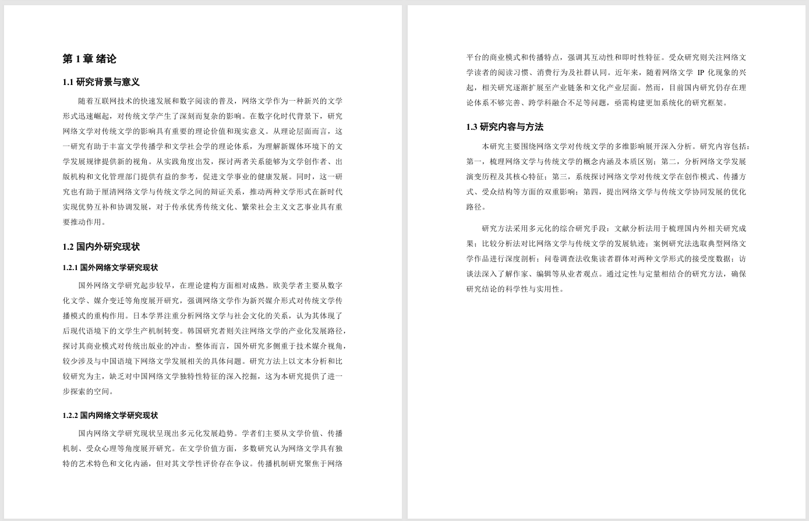

# Pagergen 论文生成

Pagergen是一个智能论文主体生成工具，旨在帮助用户快速构建结构完整、格式规范的毕业论文。支持自动生成目录、摘要、正文、表格及对应描述，并导出为 Word 和 PDF 格式 


## 一、核心功能 ✨
- 自动化生成：仅需输入论文题目，从表格插入到格式排版，全程无需手动操作
- 结构化输出：自动生成「章节正文（docx）、论文目录（JSON）、摘要（JSON） 等」，支持二次开发；  
- 灵活配置：适配不同 LLM 服务（OpenAI API/本地化模型）；  
- 高效生成：支持多线程并发生成，单篇论文平均耗时30s。
- 学术规范适配: 内置标准论文格式样式（标题层级、字体设置、行距缩进等），符合高校通用规范


## 二、前置准备 ⚙️

### 1. 环境要求
- Python 3.12+  
- LLM 服务访问权限（需配置 API 密钥或本地化模型地址）  
- 依赖包：见 `requirements.txt`

```bash
git clone git@github.com:LE1X1N/PaperGen.git
cd PaperGen
```

### 2. 安装依赖 
```bash
pip install -r requirements.txt
```

### 3. LLM配置
编辑 `conf/service_config.yaml`，修改openai相关配置：

```yaml
openai:
    base_url: https://dashscope.aliyuncs.com/compatible-mode/v1 
    model: qwen3-coder-flash
```


## 三、使用指南 📑

指定论文标题, 生成默认配置的论文主体

```bash
python app.py --title "基于SpringBoot的网吧管理系统"
```

```bash
python app.py --title "基于协同过滤算法的电影推荐小程序"
```

```bash
python app.py --title "基于物联网的智能家居系统设计"
```

```bash
python app.py --title "网络文学对传统文学的影响"
```

```bash
python app.py --title "中小企业融资困境与突破路径研究"
```


## 四、效果演示 🎬

### 1. 输出文件结构

默认文件输出路径为 `cache/` 文件夹，`docs/` 文件夹中提供测试案例参考～

``` plaintext
cache
  └─ 中小企业融资困境与突破路径研究
     ├─ abstract.json                     # 引言
     ├─ main_body.json                    # 正文
     ├─ structure.json                    # 目录 
     ├─ tables.json                       # 表
     ├─ tables_desc.json                  # 表描述
     └─ 中小企业融资困境与突破路径研究.docx  # 论文
```





## 五、项目结构 🌳

```
PaperGen
├─ app.py                       # 入口文件
├─ conf 
│  └─ service_config.yaml       # 配置文件
├─ docs
├─ README.md
├─ requirements.txt
└─ src
   ├─ config
   │  └─ __init__.py            # 配置初始化
   ├─ llm
   │  ├─ client.py              # LLM服务器连接
   │  ├─ prompt.py              # 提示词相关
   │  └─ __init__.py
   ├─ service
   │  ├─ content
   │  │  ├─ json_generator.py       # JSON类型内容生成，如目录JSON，需求表格JSON等
   │  │  ├─ section_generator.py    # 纯文本内容生成，支持多线程
   │  │  └─ __init__.py
   │  └─ doc
   │     ├─ doc_composer.py          # 文档组装
   │     ├─ pipeline.py              # 核心流程控制
   │     ├─ style_controller.py      # 风格控制
   │     └─ __init__.py
   └─ utils
      └─ common.py
```

# ⚠️ 重要提示 ⚠️

本项目仅为技术测试与学习交流用途，生成的论文内容仅作格式与结构参考。学术创作需严格遵守原创性原则和学术规范，请勿将本工具生成的内容直接用于课程作业、毕业设计、期刊发表等正式场景，由此引发的学术不端问题需由使用者自行承担。